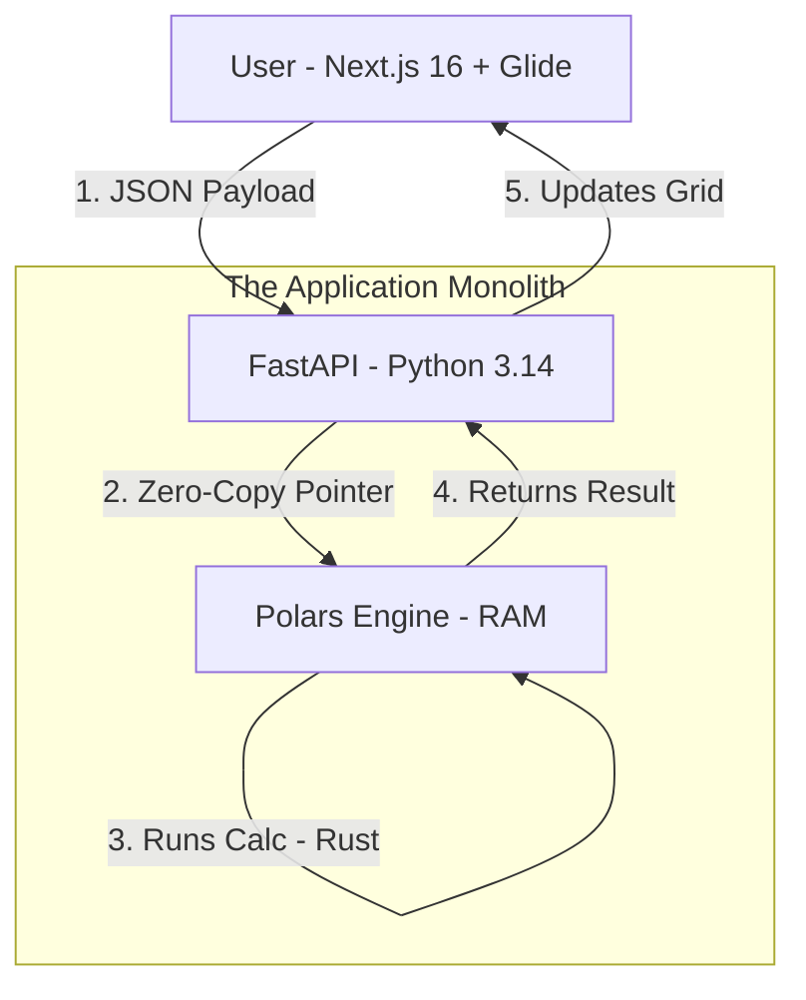

# PLAN-IT | MASTER PRD (v5.2)
## Integrated FP&A Platform for KSA Community Schools (AEFE)

---

## Meta Data

| Details | Value |
|---------|-------|
| Project Name | Plan-It (Pilot Cockpit) |
| Version | 5.2 (FINAL - Tech Stack Aligned) |
| Target Entity | EFIR (KSA Community School - Non-Profit / Conventionné) |
| Core Architecture | PostgreSQL ltree + Unified Python Cube (FastAPI/Polars) |
| Primary Currency | SAR (Operational) / EUR (Reporting) |
| Objective | Shift from "Passive Accounting" to "Strategic Piloting" |

---

## 1. Executive Summary & Strategic Vision

### 1.1 The Problem: "Flying Blind"

The school currently operates with scattered data (Admissions in Excel, HR in files, Accounting in Sage). The Board receives financial data too late to act. There is no visibility into the true Cost per Student or the Cash Flow Runway during critical months (July/August).

### 1.2 The Solution: The "Pilot Cockpit"

"Plan-It" is a driver-based simulation engine. It does not just aggregate numbers; it calculates the future based on operational drivers.

**The "North Star" Strategy: Leverage Labor Cost Arbitrage.**

| Model | Description |
|-------|-------------|
| Standard Model | Hire Sponsored Staff (High Cost: Iqama, Ticket, Medical) |
| Strategic Model | Hire Family Visa Staff (Low Cost: Ajeer, No Ticket, Minimized overhead) |

**The Value:** The platform will visualize exactly how shifting the hiring mix creates the surplus needed for investment (IT, Buildings).

---

## 2. System Architecture: The "Pigment" Model

We are replicating Pigment's "Block Architecture" using your specific tech stack.

### 2.1 The Logic Flow (The Dependency Graph)

The system is built of 4 interconnected Blocks. Data flows in one direction:

```
Enrollment (Block A) → Divisions/Classes (Block B) → DHG/Workforce (Block C) → Financials (Block D)
```



### 2.2 The Technical Stack

> **Note:** See [Appendix A: Technical Stack Specification](#appendix-a-technical-stack-specification-v50) for full details.

**Storage Layer:**
- PostgreSQL 18 with ltree for hierarchy

**Calculation Layer (The "Brain"):**
- Engine: Polars (In-Memory Cube)
- API: FastAPI (Python 3.14)
- Manager: uv (High-speed Rust-based package manager)

**Presentation Layer:**
- Framework: Next.js 16 (React 19)
- Grid: Glide Data Grid (Canvas-based, Excel-like performance)
- Styling: Tailwind CSS 4.0 + Shadcn/UI
- Manager: pnpm (Fast, efficient dependency management)

---

## 3. Functional Module Specifications

### Module A: Enrollment & Divisions (The Driver)

**Logic:** Students drive Classes (Divisions), which drive Hours.

| Feature | Logic / Requirement | AEFE Specifics |
|---------|---------------------|----------------|
| Waterfall Logic | Opening + New Recruits - Departures = Closing | Map "Academic Year" (Sept-Jun) to "Fiscal Year" (Jan-Dec) |
| Division Driver | `ROUNDUP(Student_Count / Max_Cap)` | Constraint: Max Cap is strict (e.g., 28). If Students = 29, you open a 2nd Division |
| Output | Number of Divisions (e.g., 3x 6ème, 2x 5ème) | This integer is the specific input for the DHG Module |

### Module B: Workforce & DHG Engine (The Core Challenge)

**Logic:** Calculate "Dotation Horaire Globale" (Total Hours) to derive FTEs.

**Context:** Unlike Primary school (1 Class = 1 Teacher), Secondary school uses a pool of hours distributed across subjects.

#### 3.1 The DHG Calculation Steps

The system must calculate the Total Weekly Hours Needed before calculating cost.

**1. Calculate Theoretical DHG:**
- Formula: `Σ (Divisions_per_Grade × Legal_Hours_per_Grade)`
- Example: 3 classes of 6ème × 26h = 78h

**2. Add Group/Option Hours:**
- Add hours for split groups (Science labs, Languages) and options (Latin, Sections Internationales)

**3. H/E Ratio Validation (The "Benchmark"):**
- Calculate H/E (Heures / Élève): `Total DHG / Total Students`
- Logic: Compare vs. AEFE Benchmark Curve (from Tables Enseignants.csv)
- Alert: If H/E > 1.45 (for Lycée), flag as "Inefficient Structure"

#### 3.2 The FTE Transformation

Convert Hours into People (Full Time Equivalents) to apply costs.

**Formula:** `Total DHG / Statutory Service Hours`

**Service Divisors:**
| Type | Hours/Week |
|------|------------|
| Certifiés | 18h |
| Agrégés | 15h |
| PE (Primary) | 24h (Direct logic) |

**Result:** "We need 4.5 FTE in Math, 3.2 FTE in English."

#### 3.3 The "Arbitrage" (Contract Mix)

Once FTEs are defined, the user assigns Contract Types to fill them.

- **Input:** "We need 4.5 Math FTE."
- **Strategy:** "Assign 2.0 to Résidents (Expats), 2.5 to Local Family Visa."

**Cost Calculation:**
| Contract Type | Payment |
|---------------|---------|
| Résident | Paid in EUR (PRRD + ISVL) |
| Local (Family) | Paid in SAR (Ajeer, No Iqama cost) |

### Module C: Financials (P&L & Cash)

**Logic:** Dual Reporting (Local vs. Paris) and Liquidity Management.

| Feature | Logic | KSA Specifics |
|---------|-------|---------------|
| VAT Engine | Check `Student_Nationality`. Saudi: 0% VAT (Exempt). Non-Saudi: 15% VAT (Liability) | |
| Cash Flow | Operating Cash Out vs In | Tranche Logic: Tuition enters in Aug/Jan/Apr. Salaries exit Monthly |
| Costing | FTE × Contract_Profile | Differentiate Sponsored (Iqama+Medical) vs Family (Ajeer) |

---

## 4. Data Model Alignment (Schema Updates)

To support the DHG logic, we update the Schema.

### Table: `grade_levels` (Static Data)

| Column | Type | Description |
|--------|------|-------------|
| `legal_hours_per_week` | NUMERIC | e.g., 26 for 6ème, 24 for CP |
| `cycle_type` | ENUM | 'MATERNELLE', 'ELEMENTAIRE', 'COLLEGE', 'LYCEE' |

### Table: `dhg_inputs` (Planning Data)

| Column | Type | Description |
|--------|------|-------------|
| `division_count` | INTEGER | Calculated from Enrollment |
| `group_hours` | NUMERIC | Manual adjustment for labs/options |
| `weighting_coefficient` | NUMERIC | e.g., 1.1 for REP+ or specialized tracks |

---

## 5. Reporting & Analytics (The Cockpit)

### Quadrant 1: The "H/E" Efficiency
- **Metric:** "Heures d'Enseignement par Élève"
- **Visual:** Line chart comparing Current School H/E vs AEFE Theoretical Target
- **Insight:** "Your Lycée H/E is 1.6. Target is 1.4. You are 'over-teaching' by 20 hours/week (~1 FTE)."

### Quadrant 2: Financial Health
- **Projected Surplus:** Live calculation based on `(Tuition - (FTE × Avg_Cost))`
- **Staff Cost Ratio:** Target < 70%

### Quadrant 3: Enrollment vs Divisions
- **Threshold Alert:** "Grade 4 is at 29 students. You triggered a new Division (+1 Teacher Cost). Can we refuse 1 student to save 250k SAR?"

### Quadrant 4: Strategic Mix
- **Metric:** % of DHG covered by "Family Visa" contracts
- **Target:** Increase from 20% to 35% to generate surplus

---

## 6. Implementation Phases

### Phase 1: The Foundation (Week 1)
- **Tech Setup:** Initialize Monorepo with uv (Backend) and pnpm (Frontend)
- **Database:** Deploy Schema v2.5 with `dhg_inputs` table
- **Seed Data:** Load AEFE Benchmark Curves (from Tables Enseignants.csv)

### Phase 2: The Logic (Week 2-3)
- Build `calc_dhg.py`: The Polars script that converts Divisions → Hours → FTE
- Implement the "Service Divisor" logic (15h vs 18h)

### Phase 3: The Pilot (Week 4)
- Load 2023-2024 Actuals
- Generate the first "H/E Efficiency Report" for the Board

---

---

# Appendix A: Technical Stack Specification (v5.0)

## High-Performance "Cube" Architecture (Unified Python)

| Meta Data | Details |
|-----------|---------|
| Project | Plan-It (EFIR Pilot) |
| Architecture Logic | Unified Monolith (Zero-Copy Calculation) |
| Package Manager | pnpm (Frontend) / uv (Backend) |
| Status | LOCKED (Do not deviate) |

## 1. The Architectural Strategy

We utilize the Unified Python architecture to eliminate serialization latency.

- **Frontend:** Managed by pnpm. Optimized for Next.js Turbo.
- **Backend:** Managed by uv (The Rust-based Python package manager).

## 2. The Frontend Stack: "The Cockpit"

Context: High-performance dashboarding matching "Pigment" aesthetics.

### 2.1 Core Framework (LOCKED)

| Component | Version |
|-----------|---------|
| Package Manager | pnpm 9.15.0+ |
| Framework | Next.js 16.1.0 (React 19, Turbopack) |
| Language | TypeScript 5.7 |

### 2.2 UI & Styling Strategy (The Pigment Look)

| Component | Choice | Rationale |
|-----------|--------|-----------|
| Styling Engine | Tailwind CSS 4.0 | Oxide Engine (Rust). Compiles CSS instantly. Zero-runtime overhead. |
| Component System | Shadcn/UI (Radix Primitives) | Clean lines, dense typography (text-xs / text-sm), subtle borders. |
| Icons | Lucide React | |
| Navigation | cmdk | Command K palette for keyboard-first navigation. |

### 2.3 The "Excel" Core

| Component | Version | Purpose |
|-----------|---------|---------|
| Grid | Glide Data Grid 6.0.6 | Canvas-based rendering (60fps). Freezing columns, range selection, copy/paste. |
| State | Zustand 5.0.3 | |
| Fetch | TanStack Query 5.62.0 | |
| Validation | Zod 3.24.1 | |

### 2.4 Workspace Architecture (The Pigment Pattern)

**Requirement:** One Page per Module. No Reloads.

**Layout:** DashboardLayout (Persistent Sidebar + Top Bar).

**Top Bar:** Contains the Global Scenario Selector (Base Budget vs. Scenario A). Changing this updates the `scenarioId` in the URL query params, triggering a re-fetch of the Grid data without reloading the page.

**Routes:**
- `/workspace/enrollment`: The Revenue Engine Workspace
- `/workspace/workforce`: The DHG & Staffing Workspace
- `/workspace/financials`: The P&L & Cash Flow Workspace

**UX:** Each workspace takes 100% of the remaining screen height. The Grid is "sticky" and scrolls internally.

## 3. The Unified Backend: "The Cube"

Context: High-performance Python runtime acting as both API and Calculator.

| Component | Version | Notes |
|-----------|---------|-------|
| Package Manager | uv 0.5.0+ | |
| Runtime | Python 3.14.2 | Optimized build |
| Web Framework | FastAPI 0.115.6 | |
| Server | Uvicorn 0.34.0 | Standard, or Granian |
| Calculation Engine | Polars 1.36.0 | In-Memory Cube. Holds Plan Data in Apache Arrow format. |
| OLAP Accelerator | DuckDB 1.1.3 | |
| Validation | Pydantic 2.10.0 | |

## 4. The Data Layer: "The Vault"

| Component | Version |
|-----------|---------|
| Database | PostgreSQL 18.0 |
| Extension | ltree (Hierarchy) |
| Caching | Redis 8.0-M02 |

## 5. Infrastructure (Docker)

```yaml
services:
  # 1. The Monolith (Brain + API)
  planit-core:
    image: python:3.14-slim
    ports: ["8000:8000"]
    environment:
      - WORKERS=4
    command: /bin/sh -c "uv sync && uv run uvicorn main:app --host 0.0.0.0"
    deploy:
      resources:
        limits:
          memory: 4G # Needs RAM for the Cube

  # 2. The UI
  planit-web:
    image: node:22-alpine
    ports: ["3000:3000"]
    command: /bin/sh -c "npm install -g pnpm && pnpm install && pnpm dev"

  # 3. Storage
  postgres:
    image: postgres:18-beta
  redis:
    image: redis:8.0-alpine
```

## Summary of Locked Decisions

| Layer | Stack |
|-------|-------|
| Frontend | pnpm + Next.js 16.1 + Tailwind CSS 4.0 + Glide Data Grid 6.0 |
| Backend | uv + Python 3.14 + FastAPI + Polars |
| UX Pattern | One Workspace Per Module with Global Scenario Context |

---

---

# Appendix B: PRD Review & Gap Analysis

> **Reviewer:** Claude Code
> **Date:** 2024-12-28
> **Status:** Conditionally Approved

## Executive Summary

This PRD provides a solid foundation with clear business objectives and domain-specific logic (DHG, H/E ratios, AEFE compliance). The tech stack is cutting-edge but verified as available. Several gaps should be addressed before implementation.

---

## Tech Stack Verification (Confirmed Available)

| Technology | Specified Version | Verified Release Date |
|------------|-------------------|----------------------|
| Python | 3.14.2 | Oct 7, 2025 |
| Next.js | 16.1.0 | Dec 18, 2025 |
| PostgreSQL | 18.0 | Sept 25, 2025 |
| React | 19 | Available |
| Tailwind CSS | 4.0 | Oxide Engine available |

All specified versions are confirmed available and production-ready.

---

## Remaining Gaps to Address

### Critical (Before Development)

#### 1. Missing User Roles & Permissions

The PRD does not define:
- Who are the system users? (Admin, Finance Manager, Board Member, Principal?)
- What can each role see/edit?
- Approval workflows for budget changes

**Required Addition:**
```markdown
## User Roles
| Role | Access Level | Capabilities |
|------|--------------|--------------|
| Super Admin | Full | All CRUD, User Management |
| Finance Manager | High | Budget editing, Reporting |
| Board Member | Read | Dashboard, Reports only |
| Principal | Medium | Enrollment, DHG viewing |
```

#### 2. Missing Non-Functional Requirements (NFRs)

No specifications for:
- **Performance:** Response time targets, concurrent users
- **Availability:** Uptime SLA (99.9%?)
- **Security:** Authentication method (OAuth? SSO?)
- **Backup/Recovery:** RPO/RTO targets
- **Scalability:** Multi-school support?

#### 3. Missing Integration Specifications

The PRD mentions existing systems but lacks integration details:
- **Sage Accounting:** How do we sync? API? CSV export? Real-time?
- **AEFE Systems:** Data exchange format with Paris headquarters?
- **HR Systems:** Employee data import mechanism?

#### 4. No API Specifications

Missing:
- Endpoint definitions
- Request/Response schemas
- Authentication flow
- Rate limiting
- Error response format

---

### Major Gaps (Should Fix)

#### 5. Currency Conversion Strategy

PRD mentions SAR (Operational) / EUR (Reporting) but doesn't specify:
- Exchange rate source (fixed? live API?)
- Conversion frequency
- Historical rate handling
- Variance reporting due to FX

#### 6. Audit Trail Requirements

Critical for financial systems:
- Who changed what, when?
- Version history for budgets
- Approval audit logs
- Data lineage tracking

#### 7. Error Handling & Edge Cases

Missing scenarios:
- What if enrollment exceeds capacity?
- What if DHG calculation results in fractional FTEs?
- How to handle mid-year staff changes?
- Currency conversion failures?

#### 8. Testing Strategy

No mention of:
- Unit testing approach
- Integration testing
- E2E testing
- Performance testing
- UAT process

#### 9. Acceptance Criteria

Features lack specific acceptance criteria. Example needed:
```markdown
### Feature: Division Calculation
**Given** Grade 6 has 57 students
**And** Max capacity is 28
**When** Division calculation runs
**Then** Result should be 3 divisions (ROUNDUP(57/28) = 3)
```

---

### Minor Gaps (Nice to Have)

#### 10. Localization
- Language support: French, English, Arabic?
- Date formats (Gregorian vs Hijri calendar?)
- Number formatting (SAR 1,234.56 vs 1 234,56)

#### 11. Mobile Responsiveness
- Dashboard mobile support?
- Offline capability for board members?

#### 12. Data Validation Rules
- Enrollment number constraints
- Budget amount validations
- Date range validations

---

## Positive Aspects

1. **Clear Business Objective:** "Flying Blind" → "Pilot Cockpit" narrative is compelling
2. **Domain Expertise:** DHG calculations, H/E ratios, AEFE compliance well-documented
3. **Strategic Value:** Labor cost arbitrage strategy clearly articulated
4. **Modular Architecture:** Block A→B→C→D dependency flow is clean
5. **Visual Dashboard:** Four-quadrant cockpit design is actionable
6. **Implementation Phases:** Realistic 4-week pilot timeline
7. **Modern Tech Stack:** Cutting-edge, high-performance stack with Turbopack, Polars, and zero-copy architecture

---

## Recommended Actions

### Immediate (Before Development)

- [ ] Define user roles and permission matrix
- [ ] Add NFR section (performance, security, availability)
- [ ] Specify Sage integration approach
- [ ] Add API endpoint specifications

### Before Phase 2

- [ ] Document currency conversion strategy
- [ ] Add audit trail requirements
- [ ] Define error handling for edge cases
- [ ] Write acceptance criteria for core features

### Before Phase 3 (Pilot)

- [ ] Create testing strategy
- [ ] Plan UAT with actual users
- [ ] Prepare training materials

---

## Suggested Schema Additions

Based on the review, consider adding these tables:

```sql
-- Audit trail
CREATE TABLE audit_logs (
    id UUID PRIMARY KEY,
    table_name VARCHAR(100),
    record_id UUID,
    action VARCHAR(20), -- INSERT, UPDATE, DELETE
    old_values JSONB,
    new_values JSONB,
    user_id UUID,
    timestamp TIMESTAMPTZ DEFAULT NOW()
);

-- Currency rates
CREATE TABLE exchange_rates (
    id UUID PRIMARY KEY,
    from_currency VARCHAR(3),
    to_currency VARCHAR(3),
    rate DECIMAL(10, 6),
    effective_date DATE,
    source VARCHAR(50) -- 'manual', 'api', 'aefe_official'
);

-- User roles
CREATE TABLE user_roles (
    id UUID PRIMARY KEY,
    name VARCHAR(50),
    permissions JSONB,
    created_at TIMESTAMPTZ DEFAULT NOW()
);
```

---

## Conclusion

The PRD demonstrates strong domain knowledge, clear business value, and a modern high-performance tech stack. The remaining gaps are primarily around operational requirements (roles, NFRs, integrations) rather than technical design. Address the **Critical** items before development, and the **Major** items during Phase 1 setup.

**Overall Assessment:** 🟢 **Approved** - Ready to proceed after addressing critical gaps
